# 🚀 Advanced Voice Agent Features Plan (Gemini + Deepgram + Murf)

To create a cutting-edge **Conversational Health Agent**, we will integrate the following specific technologies as requested:

## 1. 🧠 Intelligence: Google Gemini Pro
**Role**: The "Brain" of the agent.
**Why**: High-performance reasoning for medical symptoms and risk analysis.
**Integration**: 
   - Replace/Augment existing CrewAI agents to use `ChatGoogleGenerativeAI`.
   - **Requirement**: `GOOGLE_API_KEY`.

## 2. 👂 Ears: Deepgram Nova-2
**Role**: Real-time Speech-to-Text (STT).
**Why**: Fastest and most accurate medical transcription.
**Integration**: 
   - Streamlit audio recorder captures user voice.
   - Send audio to Deepgram API.
   - Receive instant transcript to feed into Gemini.
   - **Requirement**: `DEEPGRAM_API_KEY`.

## 3. 🗣️ Voice: Murf AI
**Role**: Text-to-Speech (TTS).
**Why**: Ultra-realistic, human-like AI voices (e.g., a calm "Doctor" voice).
**Integration**: 
   - Gemini generates the health advice.
   - Send text to Murf AI API.
   - Receive audio file and play it back in Streamlit.
   - **Requirement**: `MURF_API_KEY` (or `MURF_API_TOKEN`).

---

## 🛠️ Implementation Architecture

```mermaid
graph LR
    User((User)) -- "🎤 Voice" --> Streamlit[Streamlit UI]
    Streamlit -- "Audio" --> Deepgram[Deepgram STT]
    Deepgram -- "Text" --> Gemini[Gemini Pro Agent]
    Gemini -- "Analysis" --> Murf[Murf AI TTS]
    Murf -- "Audio Response" --> Streamlit
    Streamlit -- "🔊 Plays" --> User
```



## 📦 New Dependencies
```text
google-generativeai
deepgram-sdk
requests (for Murf API)
streamlit-mic-recorder
```

## 🔑 Required API Keys

To proceed, please provide the following keys:

| Service | Env Variable | Status |
| :--- | :--- | :--- |
| **Google Gemini** | `GOOGLE_API_KEY` | ❌ Missing |
| **Deepgram** | `DEEPGRAM_API_KEY` | ❌ Missing |
| **Murf AI** | `MURF_API_KEY` | ❌ Missing |

### 📝 Next Steps
1.  **User**: Provide the 3 API keys.
2.  **Dev**: Install dependencies.
3.  **Dev**: Create `src/integrations/voice_service.py` to handle Deepgram/Murf.
4.  **Dev**: Update `HealthAgents` to use Gemini.
5.  **Dev**: Add "Voice Mode" toggle in Streamlit Dashboard.

**Ready to build? Please paste your keys!**
